# Enterprise AWS 3-Tier Architecture

A hands-on AWS portfolio project demonstrating the design, deployment, security, validation, and troubleshooting of a multi-AZ three-tier cloud architecture.

## Project Overview

This project implements an enterprise-style AWS environment with separate public, application, and database tiers. The application tier runs across two Availability Zones behind an Application Load Balancer, while the database tier uses a private Amazon RDS MySQL instance. Administrative access is handled through AWS Systems Manager rather than public IP addresses, and database credentials are stored in AWS Secrets Manager.

## Architecture

.png)

**Region:** US East (Ohio) — `us-east-2`

The environment includes a custom `10.10.0.0/16` VPC, six subnets across two Availability Zones, an Internet Gateway, NAT Gateway, dedicated route tables, an internet-facing Application Load Balancer, two private Amazon Linux EC2 application servers, a private Amazon RDS MySQL database, AWS Secrets Manager, IAM, Systems Manager, and tier-specific security groups.

### Network Segmentation

```text
Public Tier
10.10.1.0/24  - AZ1
10.10.2.0/24  - AZ2

Application Tier
10.10.11.0/24 - AZ1
10.10.12.0/24 - AZ2

Database Tier
10.10.21.0/24 - AZ1
10.10.22.0/24 - AZ2
```

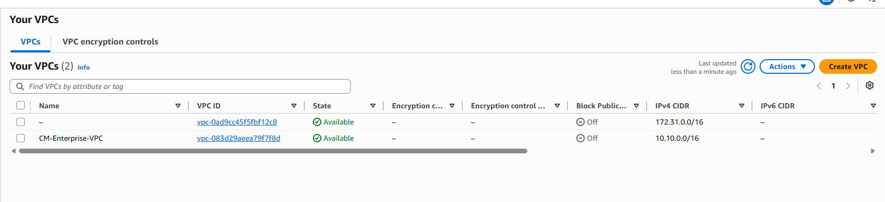

*Custom CM-Enterprise-VPC using the 10.10.0.0/16 address space.*

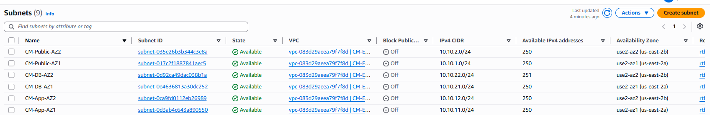

*Six-subnet design separating public, application, and database tiers across two Availability Zones.*

## Traffic Flow

```text
Internet
   |
   v
Application Load Balancer
   |
   +-------------------+
   |                   |
   v                   v
EC2 App Server AZ1   EC2 App Server AZ2
   |                   |
   +---------+---------+
             |
             v
        RDS MySQL
```

The Application Load Balancer distributes HTTP requests between private application servers in separate Availability Zones. The application servers have no public IPv4 addresses. Database access is restricted to the application tier, and RDS is not publicly accessible.

## Routing and Private-Tier Connectivity

Dedicated route tables separate public, application, and database routing. The application tier uses a NAT Gateway for required outbound connectivity while remaining inaccessible directly from the public Internet.

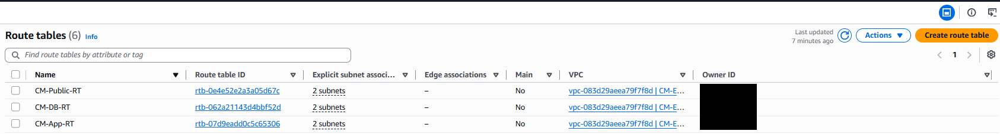

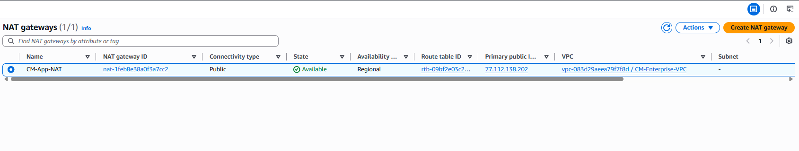

## Security Design

- The ALB security group accepts application traffic and forwards HTTP traffic to the application tier.
- The application security group allows application traffic from the ALB security group rather than exposing EC2 instances directly to the Internet.
- The EC2 instances do not require public IPv4 addresses.
- The database security group allows MySQL TCP/3306 from the application security group.
- RDS is configured as not publicly accessible.
- AWS Systems Manager Session Manager provides management access to private EC2 instances.
- The EC2 IAM role includes Systems Manager permissions and a scoped policy for retrieving the required RDS secret.

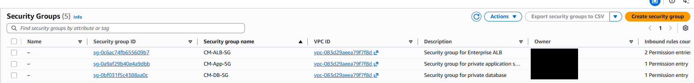

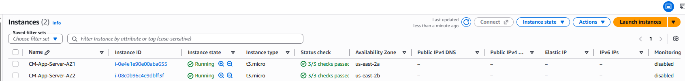

## Load Balancing and High Availability Validation

Both application servers were registered with the target group and reached a **Healthy** state.

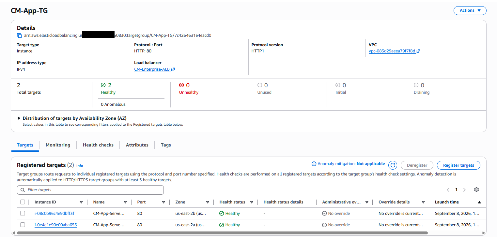

*Two healthy EC2 targets registered behind the Application Load Balancer.*

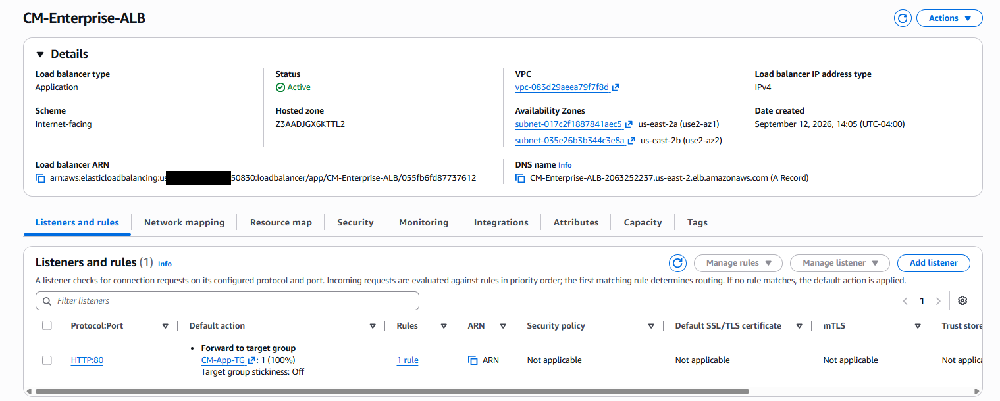

Refreshing the ALB DNS endpoint demonstrated requests being served by application servers in both Availability Zones.

| AZ1 response | AZ2 response |
|---|---|
| 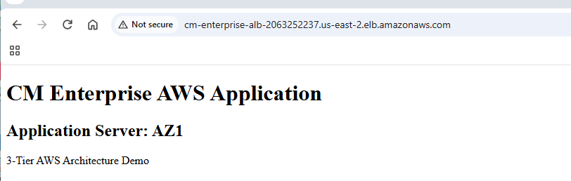 | 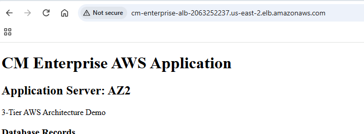 |

## Database Tier

The application tier connects to a private Amazon RDS MySQL database over TCP/3306. The database is not publicly accessible.

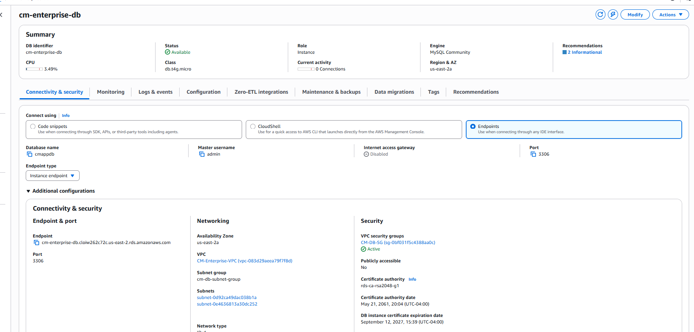

The `app_requests` table was used to validate shared database access from both application servers.

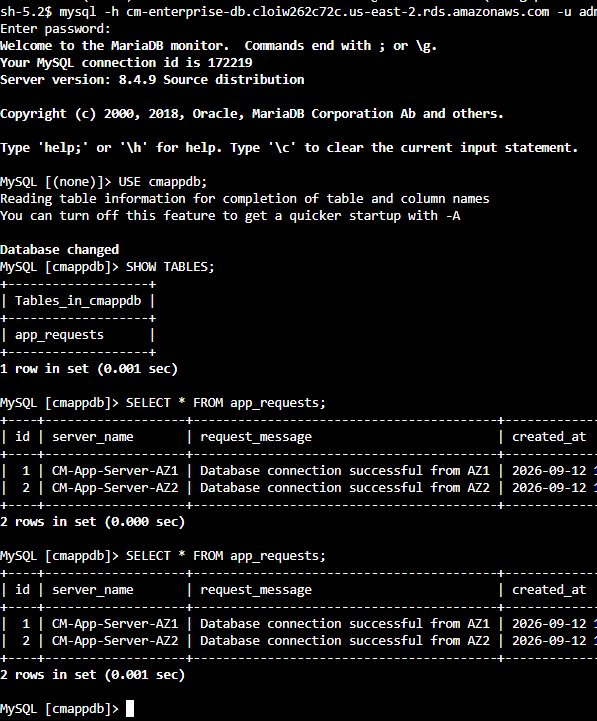

*Database records demonstrate successful connectivity from both CM-App-Server-AZ1 and CM-App-Server-AZ2.*

## Secrets Management and IAM

Database credentials were moved from application configuration into AWS Secrets Manager. The application retrieves credentials at runtime using its IAM role, eliminating the need to hard-code the database password in application files.

```text
EC2 Application Server
        |
        | IAM authorization
        v
AWS Secrets Manager
        |
        | RDS credentials
        v
Amazon RDS MySQL
```

| Secrets Manager | EC2 IAM Role |
|---|---|
| 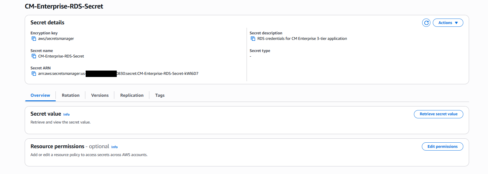 | 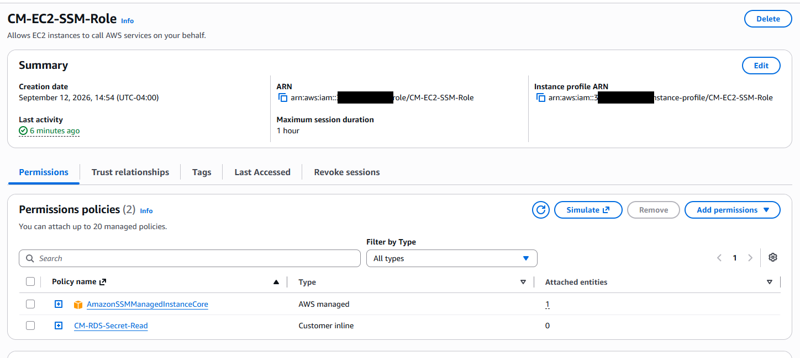 |

## End-to-End Application Validation

The final PHP application retrieves database credentials through AWS Secrets Manager, connects to RDS, and displays shared database records through the load-balanced web tier.

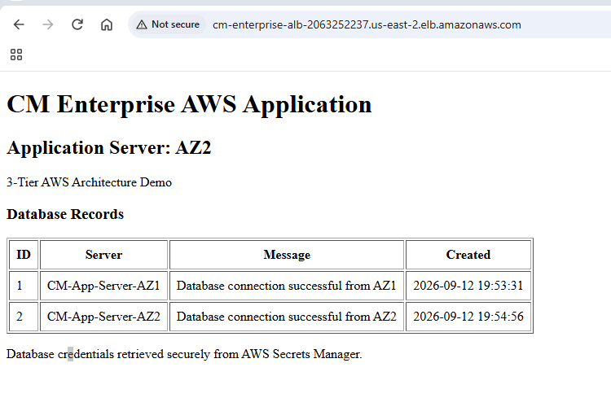

This validates the complete path:

```text
Client -> ALB -> Private EC2 Application Tier -> Private RDS MySQL
                    |
                    +-> IAM -> AWS Secrets Manager
```

## Troubleshooting Case Study

`CM-App-Server-AZ2` initially failed its Application Load Balancer health checks.

### Symptoms and Investigation

1. The Amazon Linux package repository timed out during the original user-data execution.
2. Apache (`httpd`) therefore was not installed as expected.
3. After installing and starting Apache, the target returned HTTP `403` health-check responses.
4. The web root did not contain the expected application page.

### Resolution

I connected to the private instance using AWS Systems Manager, installed and enabled Apache, created the application page under `/var/www/html/`, verified HTTP service operation, and retested the target group. Both application servers ultimately reached a Healthy target state.

### Key Lesson

A successful EC2 instance status check does not guarantee application availability. Infrastructure health, operating-system health, web-service health, network reachability, and ALB application health are separate troubleshooting layers.

## AWS Services and Skills Demonstrated

| Area | Technologies / Skills |
|---|---|
| Networking | VPC, IPv4 subnetting, multi-AZ design, public/private subnets, route tables, Internet Gateway, NAT Gateway |
| Compute | EC2, Amazon Linux, Apache, PHP |
| Traffic Management | Application Load Balancer, target groups, health checks |
| Database | Amazon RDS MySQL, private database connectivity, SQL validation |
| Security | Security groups, IAM roles/policies, Secrets Manager, least-privilege design |
| Administration | AWS Systems Manager Session Manager |
| Troubleshooting | cloud-init, repository connectivity, Linux services, HTTP 403, ALB health checks, application-to-database testing |

## Project Outcome

The finished environment demonstrates a functioning AWS three-tier architecture in which Internet traffic enters through an Application Load Balancer, requests are distributed across two private application servers in separate Availability Zones, and the application tier communicates with a private RDS MySQL database. Database credentials are retrieved securely from AWS Secrets Manager, and private EC2 administration is performed through Systems Manager.

## Future Enhancements

Potential next iterations include HTTPS with AWS Certificate Manager, Route 53 DNS, Auto Scaling, CloudWatch alarms and dashboards, AWS WAF, RDS Multi-AZ deployment, automated Secrets Manager rotation, infrastructure as code with Terraform or AWS CloudFormation, and CI/CD automation.

---

**Built as an AWS cloud/network engineering portfolio project.**